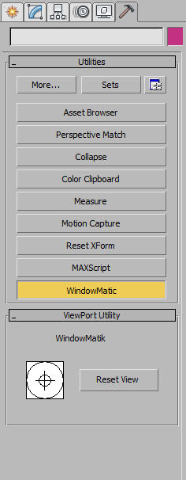

## WindowMatik 

Parenting a window from another program into a 3dsmax view.

#### Description:
The 3ds Max currently allows to replace one if its views with some views of other 3ds Max components through use of "Extended Viewports", but it is limited just to own components, while sometimes there is a need to have also another program at hand.

#### Implementation overview:
This idea was implemented as an utility plugin (might be better to have it as a GUP) and uses only the 3ds Max SDK capabilities.
The window of program to be "integrated" into 3ds Max can be picked using a tool inspired from Microsoft Spy++, which is used to "sniff" other programs.
After the necessary window handler is identified, the active view can be replaced with the view of the "handled" window.

#### Implementation details:
1. Acquire information of other non 3ds Max windows and display this information into MAXScript Listener [***WindowHunter*** part];
2. Having a handler to an opened app (g.e. Notepad), place the edit view into one of active 3ds Max viewports [***Mimiker*** part];
3. Take ***WindowHunter*** info and pass it to ***Mimiker*** so it can display itself.

Defined a very simple interface:

***Note***: The VS solution is set to be compiled for 3ds Max 2018, but this approach works also for older 3ds Max versions, or at least with 2016 one.